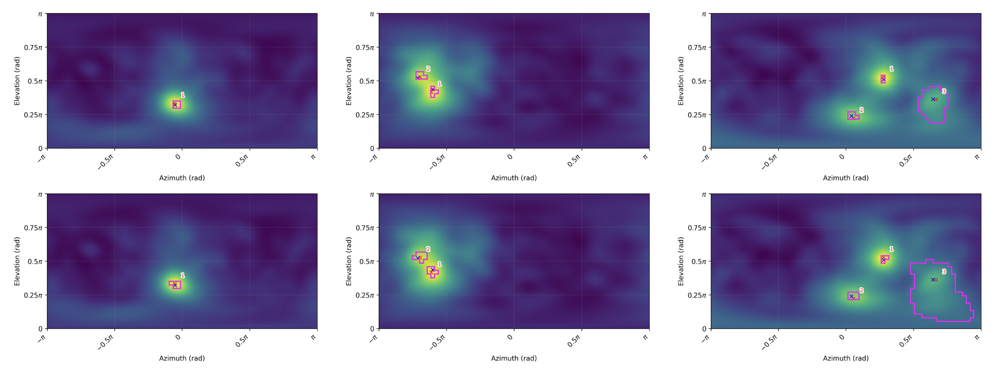

cat << 'EOF' > README.md
# Uncertainty Quantification for Multi-Sound Source Localization

This repository provides the code and datasets used for **uncertainty quantification (UQ)** in **multi-speaker sound source localization (SSL)**.  
The implementation includes methods based on **Conformal Risk Control (CRC)** and **Pareto-Testing**, enabling uncertainty-aware localization under both **known** and **unknown source count** settings.

The repository supports experiments using outputs from classical localization algorithms (e.g., **SRP-PHAT**) as well as learning-based models (e.g., **SRP-DNN**).

---

# Installation

Clone the repository:

\`\`\`bash
git clone https://github.com/yourusername/ssl_uq.git
cd ssl_uq
\`\`\`

Create a Python environment (recommended):

\`\`\`bash
python -m venv venv
source venv/bin/activate
\`\`\`

Install dependencies:

\`\`\`bash
pip install -r requirements.txt
\`\`\`

Example minimal \`requirements.txt\`:

\`\`\`
numpy
scipy
matplotlib
pandas
tqdm
\`\`\`

---

# Repository Structure

## Python Scripts

**CRC_SSL_N.py**  
Implements the **Conformal Risk Control (CRC)** framework for uncertainty quantification when the **number of sound sources is known**.

**PT_SSL_U.py**  
Implements the **Pareto-Testing method** for uncertainty quantification when the **number of sound sources is unknown**.

---

## Data

The \`data/\` directory contains **precomputed localization outputs** stored as \`.npz\` files.  
Data are organized according to **reverberation time** and **signal-to-noise ratio (SNR)**.

\`\`\`
data/
├── srp_dnn/
└── srp_phat/
\`\`\`

### Subdirectories

**srp_dnn/**  
Localization outputs produced using the **SRP-DNN model**.

**srp_phat/**  
Localization outputs generated using the **SRP-PHAT algorithm**.

Each directory contains \`.npz\` files corresponding to different experimental conditions defined by:

- Reverberation time (T60)
- Signal-to-noise ratio (SNR)

---

# Usage

## Running CRC_SSL_N.py

The \`CRC_SSL_N.py\` script evaluates the **CRC-based uncertainty quantification method** for scenarios with a **known number of sound sources**.

### Example

\`\`\`bash
python CRC_SSL_N.py \
    --plot 1 \
    --model_type SRP_PHAT \
    --num_iterations 100 \
    --seed 1234567890 \
    --snr 15 \
    --reverb 700 \
    --speakers 3 \
    --Kmax 3 \
    --lambda_steps 1000 \
    --significance_levels 0.1 0.05
\`\`\`

### Arguments

**--model_type**  
Localization model used for generating likelihood maps (e.g., SRP_PHAT).  
Default: SRP_PHAT

**--Kmax**  
Maximum number of speakers considered.  
Default: 3

**--speakers**  
True number of speakers in the experiment.  
Default: 3

**--snr**  
Signal-to-noise ratio in dB.  
Default: 15

**--reverb**  
Reverberation time in milliseconds.  
Default: 700

**--significance_levels**  
Significance levels for risk control.  
Default: [0.1, 0.05]

**--lambda_steps**  
Number of threshold candidates evaluated during calibration.  
Default: 1000

**--num_iterations**  
Number of Monte Carlo iterations.  
Default: 100

**--seed**  
Random seed for reproducibility.  
Default: 1234567890

**--plot**  
Enable visualization (1) or disable (0).  
Default: 0

---

## Running PT_SSL_U.py

The \`PT_SSL_U.py\` script evaluates the **Pareto-Testing method** for uncertainty quantification when the **number of sound sources is unknown**.

### Example

\`\`\`bash
python PT_SSL_U.py \
    --dataset SYNTHETIC \
    --localization SRP_PHAT \
    --test_on_locata 0 \
    --num_iterations 100 \
    --calib_opt 200 \
    --calib_test 200 \
    --test_sets 100 \
    --seed 1234567890 \
    --snr 15 \
    --reverb 400 \
    --Kmax 3 \
    --delta 0.1 \
    --alpha_MC 0.1 \
    --alpha_MD 0.1
\`\`\`

### Arguments

**--dataset**  
Dataset used for evaluation (e.g., SYNTHETIC).  
Default: SYNTHETIC

**--localization**  
Localization algorithm used to generate likelihood maps.  
Default: SRP_PHAT

**--test_on_locata**  
Enable testing on the LOCATA dataset (1) or disable (0).  
Default: 0

**--num_iterations**  
Number of Monte Carlo iterations.  
Default: 100

**--calib_opt**  
Number of calibration samples used for optimization.  
Default: 200

**--calib_test**  
Number of calibration samples used for testing.  
Default: 200

**--test_sets**  
Number of evaluation test sets.  
Default: 100

**--seed**  
Random seed for reproducibility.  
Default: 1234567890

**--snr**  
Signal-to-noise ratio in dB.  
Default: 15

**--reverb**  
Reverberation time in milliseconds.  
Default: 400

**--Kmax**  
Maximum number of speakers considered.  
Default: 3

**--delta**  
Risk tolerance parameter.  
Default: 0.1

**--alpha_MC**  
Significance level for miscoverage risk.  
Default: 0.1

**--alpha_MD**  
Significance level for miss-detection risk.  
Default: 0.1

---

# Contact

For questions or collaboration inquiries, please contact:

**Vadim Rozenfeld**  
Tel Aviv University  
vadimroz@mail.tau.ac.il

---

[//]: # (# License)

[//]: # ()
[//]: # (Please specify the license governing this repository &#40;e.g., MIT, GPL, Apache-2.0&#41;.)

[//]: # ()
[//]: # (---)

[//]: # (# Acknowledgments)

[//]: # ()
[//]: # (If this repository supports a research publication, please cite the corresponding paper.)

[//]: # (EOF)